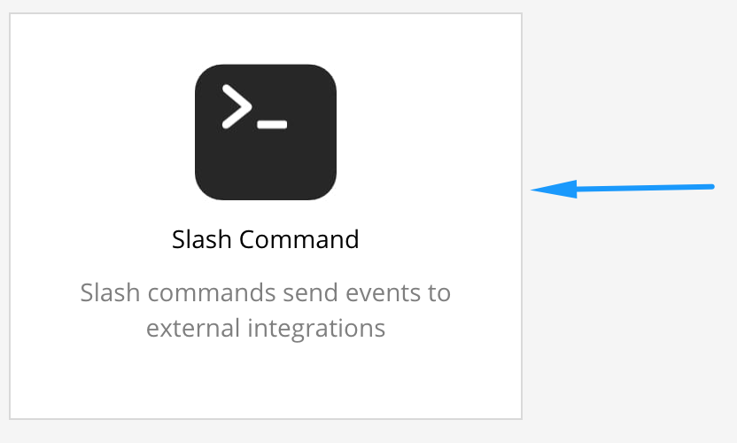

# Centreon ChatOps

This module provide the communication between a Team chat like Mattermost or
Slack and Centreon throught slash command.

## Installation

### Install files

#### By RPMs

If you use Centreon 3.4 on el7 (CentOS 7 and RedHat 7), you can download the rpm and install this one like follow.

```shell
rpm -Uvh centreon-chatops.1.0.0-beta.1-1.el7.rpm
```

#### By sources

The module can be installed by copy the sources. You can follow this commands, you need to replace [/usr/share/centreon] by your centreon installation path.

```shell
git clone https://github.com/centreon/centreon-chatops.git
cd centreon-chatops
cp -r src/ [/usr/share/centreon]/www/modules/centreon-chatops/
```

### Activate the module on Centreon

You can activate the module in Centreon Web on page *Administration >
Extensions > Modules*.


## Configuration

Once the installation is done, you need to configure your team chat to access
the service on Centreon.

Actually, only Mattermost is supported. You need to configure the slash command
on the Mattermost settings. You can get more information on [Mattermost documentation site](https://docs.mattermost.com/developer/slash-commands.html).

### Step 1

You need to validate if custom slash command is enable on Mattermost. You need to access on Mattermost System Console on *Integrations > Custom Integrations*.


## Step 2

You configure the custom slash command on Mattermost. You access to *Integrations* menu of your team.


The next action is to access to the *Custom Slash Command*.



Add a new slash command.


Complete the add form like you want.

You need the following information to complete the form.

Fields | Value
-------|-------
Command Trigger Word | centreon (by default, you can change)
Request URL | http://your.centreon.tld/centreon/modules/centreon-chatops/webhook/mattermost.php
Request Method | POST

The rest of the fields, you can complete with your information.

## Step 3

You need to configure the custom slash command token on Centreon on page *Administration > Extensions > Tokens*.

Add a new token.


Choose the *Client type* to mattermost and copy your Mattermost token.


## Step 4

You can run the help command on Mattermost.

```
/centreon help
```


